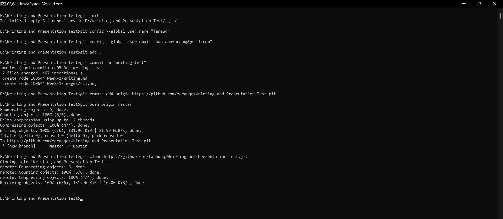

# Writing and Presentation Test Week 1

## Unix Command Line

- Shell Merupakan program yang menerima perintah kita kemudian meneruskan perintah tersebut untuk dieksekusi oleh sistem.
- Command Line Interface (CLI) merupakan jenis shell yang berbasis teks. Shell berbasis teks banyak contohnya seperti sh, bash, zsh, cmd.exe dll.
- Terminal Emulator adalah Aplikasi yang digunakan untuk mengakses Command Line Interface (CLI), disinilah user dapat memberikan suatu perintah atau command.
- File System mengatur cara bagaimana data disimpan dalam sistem. Contoh dalam Sistem operasi Windows & Unix-like menyusun file dan direktori menggunakan struktur yang bentuknya mirip tree/ pohon.
  &nbsp;
  #### Navigasi menggunakan CLI
- Command “pwd” (Print working directory) untuk melihat current working directory
- Command “dir” untuk melihat isi sebuah directory
- Command “cd” (change directory) untuk pindah ke direktori lain
- Command “ls” (lists) untuk melihat isi file yang ada di sebuah direktori
  &nbsp;
  #### Manipulasi files dan directory
- Command "touch" untuk membuat file
- Command “mkdir” untuk membuat directory
- Command “cp” untuk menyalin file 
- Command “cp -R” untuk menyalin directory
- Command “mv” untuk memindahkan file
- Command “mv -R” untuk memindahkan directory
- Command “rm” untuk menghapus file 
- Command “rm -R” atau “rm -d” untuk menghapus directory

## Git & Github

- Git adalah aplikasi yang dapat melacak setiap perubahan yang ada di projek waktu ke waktu yang terjadi pada suatu folder atau file.
- Github, Gitlab dan Bitbucket adalah contoh layanan remote repository.
- Alasan Git & Github merupakan tools wajib digunakan? Karena dengan menggunakan GIT dan Github, kamu akan bisa bekerja dalam sebuah tim. Tujuan besarnya adalah kamu bisa berkolaborasi mengerjakan proyek yang sama tanpa harus repot copy paste folder aplikasi yang terupdate.
- Alur kerja dalam Git, yang pertama adalah membuat perubahan terhadap file – file yang ada di dalam directory, directory ini disebut Working Directory, perubahan ini dapat berupa Penambahan File, Memodifikasi File dan Menghapus File. Yang kedua adalah menyiapkan perubahan yang siap untuk “disimpan”. Tahap ini sebagai tahap Draft, didalam git istilah tersebut adalah “Staging”,files yang baru kita tambah,hapus atau modifikasi tidak akan langsung tersimpan kita harus menambahkan ke staging area. Yang ketiga adalah menyimpan draft perubahan yang kita buat,perubahan yang kita simpan disebut Commit.
- Command Git & Github
  - Command “git init" untuk membuat repository baru
  - Command "git status" untuk check repository status
  - Command "git add" untuk menambahkan files ke “staging”
  - Command "git commit" untuk menyimpan files di “staging” sebagai commit
  - Command "git log" untuk melihat histori perubahan
  - Command "git diff" untuk melihat detail perubahan
  - Command "git checkout" untuk kembali ke commit tertentu
  - Command "git reset" untuk reset files ke sebuah commit, perubahan di branch yang dihapus menjadi ‘untracked files’
  - Command "git revert" untuk undo commit, perubahan disimpan dalam commit
  - Command "git clone" untuk melakukan cloning dari github ke komputer atau local<br>
  *contoh penerapan :*  
   

## HTML

- HTML (Hypertext Markup Language) digunakan untuk menampilkan konten pada browser. Contoh konten yang dapat ditampilkan seperti Text, Image, Video, Link, dan masih banyak lainnya.
- Ada 2 tools utama yang harus dipersiapkan untuk membuat HTML :
  - Browser dapat menggunakan Chrome (Recommended)
  - Code Editor dapat menggunakan Visual Code Studio (Recommended)
- Visual Studio Code adalah code editor yang dikembangkan oleh tim engineer Microsoft.
- Keunggulan Visual Studio Code dapat digunakan di Windows, Mac, dan juga Linux.
- HTML Struktur
  ```html
  <!DOCTYPE html>
  <html lang="en">
  <head>
    <meta charset="UTF-8" />
    <meta http-equiv="X-UA-Compatible" content="IE=edge" />
    <meta name="viewport" content="width=device-width, initial-scale=1.0" />
    <title>Struktur HTML</title>
  </head>
  <body>
    <h1>Hallo Farauq</h1>
    <p>Latihan HTML Struktur</p>
  </body>
  </html>
  ```
 - HTML terdiri dari komponen yang disebut HTML Tag. Pada umumnya, ada 2 tipe HTML Tag:
   - Opening Tag (tag pembuka) - contohnya adalah `` <p> ``.
   - Closing Tag (tag penutup) - contohnya adalah `` </p> ``.
- Dokumen HTML memiliki 3 tag utama, yaitu ``<html>``,``<head>``, dan ``<body>``.
- Cara menjalankan HTML :
  - Cara pertama Kita bisa menjalankan HTML dengan mencari lokasi file HTML kita lalu membukanya via browser,cara ini tidak auto reload apabila terjadi perubahan.
  - Cara ke dua kita dapat menggunakan “Live Server” pada Visual Studio Code, kita install terlebih dahulu extention “Live Server”. Jika sudah selesai install “Live Server” kita bisa klik kanan pada file HTML kita dan ada pilihan open with “Live Server” maka HTML kita sudah auto reload.
 - Tag HTML yang Populer:
    - Tag IMG digunakan untuk menyisipkan gambar
      ```html
      </img>
      ```
    - Tag Video digunakan untuk menyisipkan video
      ```html
      <video controls>
        <source src="movie.mp4" type="video/mp4">
      </video>
      ```
    - Tag Tabel
      ```html
      <table>
        <tr>
            <td>Email</td>
            <td>No.Hp</td>
            <td>Alamat</td>
        </tr>
      </table>
      ```
    - Tag Form
      ```html
      <form>
        <label for="fname">First name:</label><br>
        <input type="text" id="fname" name="fname" value="John"><br>
        <label for="lname">Last name:</label><br>
        <input type="text" id="lname" name="lname" value="Doe">
      </form>
      ```
- Semantic HTML yaitu menggunakan elemen HTML sesuai dengan kebutuhan konten.
Contohnya header, nav, article, footer, dll.
  ```html
  <body>

  <header>
    <h1>Latihan Semantic HTML</h1>
  </header>

  <nav>
    <a href="#">Home</a> 
    <a href="#">Profile</a> 
    <a href="#">Contact</a>
  </nav>

  <article>
    <h1>Latihan Semantic HTML</h1>
    <p>Semantic HTML yaitu menggunakan elemen HTML sesuai dengan kebutuhan konten</p>
  </article>

  <footer>
    Copyright &copy; 2022 by farauqq
  </footer>

  </body>
  ```
- Deploy HTML
Deploy adalah sebuah proses untuk menyebarkan aplikasi yang sudah kita kerjakan supaya bisa digunakan oleh orang-orang. Kita dapat mendeploy HTML dengan menggunakan tools yang bernama Netlify.

## CSS

- CSS (Cascading Style Sheets) adalah bahasa yang digunakan untuk mendesain halaman website.Dengan CSS, kita bisa mengubah warna, menggunakan font custom, editing text format, mengatur tata letak, dan lainnya.
- Ada 3 cara untuk menyisipkan CSS ke dalam HTML, yaitu:
  - Inline CSS, yaitu menggunakan attribute style untuk menyisipkan kode CSS langsung di dalam HTML element.
    ```html
    <h1 style="color:blue;">Selamat Datang</h1>
    ``` 
  - Internal CSS, yaitu menggunakan element <style> untuk menyisipkan kode CSS. Element <style> tersebut diletakkan di dalam element .
    ```html
    <!DOCTYPE html>
    <html>
    <head>
        <title>Internal CSS</title>
        <style>
            body {
                background-color: blue;
            }
            h1 {
                color: yellow;
            }
            p {
                color: red;
            }
        </style>
    </head>
    <body>
        <h1>Latihan Internal CSS</h1>
        <p>Ini paragraf latihan Internal CSS</p>
    </body>
    </html>
    ```
  - External CSS, yaitu sebuah file CSS terpisah yang disambungkan dengan file HTML dengan menggunakan element <link>.
      ```html
      <!-- File index.html -->
      <!DOCTYPE html>
      <html>

      <head>
          <title>Latihan Eksternal CSS</title>
          <link rel="stylesheet" href="styles.css" />
      </head>

      <body>
          <h1>Eksternal CSS</h1>
          <p>External CSS, yaitu sebuah file CSS terpisah yang disambungkan dengan file HTML dengan menggunakan element <link>.</p>
      </body>

      </html>
      ```
      
      ```html
      /* File styles.css */
      body {
          background-color: yellow;
      }
      
      h1 {
         color: blue; 
      }
      ```
- CSS Syntax adalah syntax yang digunakan untuk menunjuk atau memilih HTML element mana yang ingin diberi style (dihias). CSS syntax terdiri dari selector, property, dan value.
Contoh :
  ```html
  p {
      color:oceanblue;
  }
  ```
  penjelasan:
  - p adalah sebuah selector berupa element HTML yang akan diubah 
  - color adalah sebuah properti berupa bagian mana dari element HTML yang akan diubah. Contoh diatas mengubah warna dari teks yang ada di element p
  - oceanblue adalah value yaitu nilai/hiasan berupa warna oceanblue
   &nbsp;
  #### FLEXBOX
- Flexbox adalah cara untuk mengatur layout. Flexbox memudahkan para programmer untuk mengatur layout, posisi, dan ukuran dari tiap element di dalamnya.
- flex-direction digunakan untuk mengatur letak item child.
- Flex-secara default akan membuat tata letak item children dalam 1 line saja. flex akan menyesuaikan space yang ada.
- properti flex-flow digunakan sebagai shortcut untuk set up flex-direction dan flex-wrap bersamaan.
- properti order pada flex adalah berfungsi untuk ordering item mana yang ingin kita atur posisinya berdasarkan urutan order.
- properti justify-content digunakan untuk mengatur tata letak dan space antar item child secara horizontal atau main axis.
- properti align-items digunakan untuk mengatur align dari item child secara vertikal atau cross axis.
- properti align-self digunakan untuk mengatur align item pada masing-masing item.
- align-content digunakan untuk mengatur tata letak dan space antar item child secara vertikal atau cross axis.
- properti flex-grow dapat mengatur size suatu item child pada flexbox.
- flex-shrink adalah properti yang membuat size suatu item child mengecil secara relatif terhadap item child yang lainnya.
- flex-basis adalah properti yang sama fungsinya seperti width.

## Algoritma & Data Structure
- Algoritma adalah sekumpulan instruksi atau step-step yang dibutuhkan untuk menyelesaikan suatu masalah.
- Data Structures atau struktur data adalah teknik khusus untuk mengatur dan menyimpan data di komputer sedemikian rupa sehingga kita dapat melakukan operasi pada data yang disimpan dengan lebih efisien.Manfaat dari algoritma memudahkan kita dalam proses menyelesaikan permasalahan melalui bahasa pemrograman dan membuat program yang kita buat menjadi lebih efisien.
- Jenis Proses Algoritma:
  -  Sequence adalah Instruksi yg dijalankan secara berurutan
  -   Selection adalah Instruksi yg dijalankan jika memenuhi suatu kondisi
  -   Iteration adalah Instruksi yg berulang kali dijalankan selama memenuhi suatu kondisi
- Manfaat dari algoritma memudahkan kita dalam proses menyelesaikan permasalahan melalui bahasa pemrograman dan membuat program yang kita buat menjadi lebih efisien
- Contoh algoritma sederhana menghitung Luas Segitiga
  - Mulai
  - Deklarasi variabel luas (L), alas (a) dan tinggi (t) segitiga
  - Input nilai alas (a) dan nilai tinggi (t) segitiga
  - Proses hitung luas (L) segitiga
  - Tampilkan hasil luas (L) segitiga
  - Selesai
- Penerapkan algoritma ke dalam bahasa pemrograman (python)
  ```python
  print("Masukkan Alas Segitiga : ")
  a = float(input())
  print("Masukkan Tinggi Segitiga : ")
  t = float(input())
  l = 0.5 * a * t
  print("Luas segitiga adalah : "+ str(l))
  ```
- Pseudocode adalah menuliskan algoritma dengan umumnya bahasa inggris sebelum kita implementasikan ke bahasa pemograman tertentu.
- Panduan menulis pseudocode :
  - Huruf kapital digunakan untuk menulis perintah
  - 1 statement hanya terdiri dari 1 baris
  - Menggunakan indentasi
  - Harus bersifat spesifik dan simple
- Contoh Pseudocode:
    ```
    Judul: Program hitung_luas_segitiga
    
    Deskripsi
    var luas, alas, tinggi : integer;

    Implementasi
    alas ← 25 ; tinggi ← 30 ;
    luas ← ½*alas*tinggi
    write (luas)
    ```
- Jenis Pseudocode :
  - Procedural adalah cara berpikir secara runtun. Artinya serangkaian perintah yang berurutan.
  - Conditional digunakan saat dibutuhkan percabangan kasus. Komputer akan melakukan suatu tindakan jika suatu kondisi terpenuhi.
  - Looping digunakan saat membutuhkan perulangan dalam kasus tertentu, kita bisa menggunakan Looping.
  - Recursive adalah pola pikir dalam algoritma yang memanggil method/function didalam sebuah function.
 
 ## Javascript Dasar
- Javascript adalah bahasa pemograman yang sangat powerful yang digunakan untuk logic pada sebuah website.
- Menjalankan Javascript dapat melalui browser pada device setiap user. Umumnya browser Chrome dan Mozilla yang sudah support untuk semua fitur Javascript.
- Syntax dan Statement
Syntax bisa dianalogikan seperti kosa kata (vocabulary) dan tata cara (grammar) pada bahasa pemograman. Kita menggunakan syntax tertentu untuk membuat statement program, instruksi untuk dijalankan/dieksekusi oleh web browser, compiler, ataupun intrepreter. 
Contoh Syntax Javascript:
  - Alert()
  - Prompt()
  - Confirm()
- Tipe Data (Data Types) adalah klasifikasi yang kita berikan untuk berbagai macam data yang digunakan dalam programming. Ada 6 tipe data fundamental pada Javascript :
  - Tipe data number adalah tipe data yang mengandung semua angka termasuk angka desimal.<br>
  contoh:
      ```javascript
      let number1 = 12;
      let number2 = 24;
      let number3 = 18.21;
      ```
  - Tipe data string adalah grup karakter yang ada pada keyboard laptop/PC kita yaitu letters (huruf), number (angka), spaces (spasi), symbol, dan lainnya.
  Harus diawali dan diakhiri dengan single quotes ‘ … ‘ ataupun double quotes “ … “.  
  contoh:
      ```javascript
      let string = 'Belajar Tipe data Javascript'
      ```
  - Tipe data boolean Tipe data boolean adalah tipe data yang hanya mempunyai 2 buah nilai.
2 buah nilai tersebut adalah TRUE (benar) or FALSE (salah).
Analoginya adalah seperti tombol/button ON/OFF dan juga seperti sebuah jawaban antara YES/NO.<br>
contoh:
      ```javascript
      let benar = true;
      let salah = false;
      ```
  - Tipe data null adalah tipe data yang diartikan bahwa sebuah variable/data tidak memiliki nilai. Null berbeda dengan string kosong. String kosong masih memiliki tipe data string.<br>
  contoh:
      ```javascript
      let dataPertama = null;
      let dataKedua = null;
      let dataKetiga = "";
      
      console.log(dataPertama);
      console.log(dataKedua);
      console.log(dataKetiga);
      ```
  - Tipe data undefined dalah tipe data yang merepresentasikan varibel/data yang tidak memiliki nilai.<br>
  contoh:
      ```javascript
      let a = "skilvul";
      let b = "inalum";
      let peserta = {"david","budi","ryan"};
      
      console.log(c);  //undefined
      console.log(a); // "skilvul"
      console.log(peserta.lenght); // 3
      console.log(peserta.panjangkarakter); // undefined
      ```
  - Tipe data object adalah koleksi data yang saling berhubungan (related). Tipe data pbject dapat menyimpan data dengan tipe data apapun (number, string, boolean, dan lainnya). Tipe data object mempunyai key dan value.<br>
  contoh:
      ```javascript
      var person = {
          firstName = "farauq",
          lastName = "rifky",
          age = 20,
      };
      ```
- Variable adalah container/tempat untuk menyimpan sebuah nilai.
 Ada 3 cara mendefinisikan sebuah variabel:
  - var
  - let 
  - const
  #### Operator
- Assignment Operator (=) digunakan untuk menyimpan sebuah nilai pada variabel.<br>
 contoh : 
 `` let myName = 'Farauq Rifky' ``
- Mathematical Assignment Operator<br>
  contoh: 
  ```javascript
    let x = 4 ; 
    x *= 2 ; 
    console.log(x) // Output: 8
  ```
- Increment dan Decrement digunakan untuk menambah atau mengurangi sebesar 1 nilai.<br>
  contoh:
  ```javascript
  let a = 4;
  a++
  console.log(a) // output: 5
  ```
  ```javascript
  let b = 4;
  b--
  console.log(b) // output: 3
  ```
- Arithmetic Operator digunakan apabila melibatkan operasi matematika.
  - Pertambahan (+)
  - Pengurangan (-)
  - Perkalian (*)
  - Pembagian (/)
  - Modulus (%)
- Comparism Operator adalah operator yang membandingkan satu nilai dengan nilai lainnya.
  - Lebih Besar (>)
  - Lebih Kecil (<)
  - Lebih kecil atau samadengan (<=)
  - Lebih besar atau samadengan (>=)
  - Samadengan (===)
  - Tidak Samadengan (!==)
- Logical Operator digunakan untuk sebuah condisional pada pemograman.
  - AND operator (&&)
  - OR operator (||)
  - NOT operator (!)
  &nbsp;
  ### Js Dasar Conditional
  Conditional merupakan statement percabangan yang menggambarkan suatu kondisi.
- Macam - macam Conditional:
  - IF Statement digunakan jika kode bernilai true.<br>
  contoh:
      ```javascript
      let haus = "true";
      if (haus) {
          console.log('Yuk beli minum');
      };
      ```
  - IF … ELSE Statement, else akan mengeksekusi sebuah statement/code jika suatu kondisi bernilai FALSE.<br>
  contoh:
      ```javascript
      let haus = "false";
      if (haus) {
          console.log('Yuk beli minum');
      }else{
          console.log('Tidak beli minum');
      }
      ```
  - IF .. ELSE IF Statement dapat kita gunakan jika kita mempunyai berbagai kondisi.<br>
  contoh:
      ```  javascript
      let stopLight = 'yellow';
      
      if (stopLight === 'red'){
          console.log('Stop!');
      }else if {stopLight === 'yellow')
          console.log('Slow down.');
       }else if {stopLight === 'green')
          console.log('Go!.');
      }else {
          console.log('Caution., unknown!')
      }
      ```     
  - Switch Case Conditional digunakan jika kondisi dan percabangan terlalu banyak.<br>
  contoh:
      ```javascript
      let warna = 1;
      switch (warna) {
      case 1:
	    console.log("Merah");
		break;
	  case 2:
		console.log("Kuning");
		break;
	  case 3:
		console.log("Hijau");
		break;
	  default:
	    console.log("Warna tidak ada");
	    break;
     }
      ```
  - Ternary Operator merupakan short-syntax dari statement if ... else.<br>
  contoh :
      ```javascript
      let makan = true;
      makan ? console.log("sudah kenyang") : console.log("lapar")
      ```
  ### JS Dasar Looping
  Looping adalah statement yang mengulang sebuah instruksi hingga kondisi terpenuhi atau jika kondisi stop/berhenti tercapai.
- Macam - macam looping:
  - For digunakan apabila kita tahu seberapa banyak nilai pasti untuk pengulangannya<br>
  contoh:
      ```javascript
      for (let angka = 1; angka <= 10 ; angka++){
          console.log("Perulangan", angka);
      } 
      ```
  - While akan menjalankan instruksi pengulangan kondisi bernilai TRUE. Gunakan While Loop jika kita tidak mengetahui jumlah pasti pengulangan.<br>
  contoh:
      ```javascript
      let angka = 3 ; 
      while (angka < 10){
          console.log(angka);
          angka++ ;
      } 
      ```
  - Do While akan melakukan perulanganterlebih dahulu, kemudian memeriksa kondisinya atau sayaratnya.<br>
  contoh:
     ```javascript
     let angka = 3 ;
     do {
        console.log(angka);
        angka++ ;
     } while (angka <= 10)
     ``` 


  


